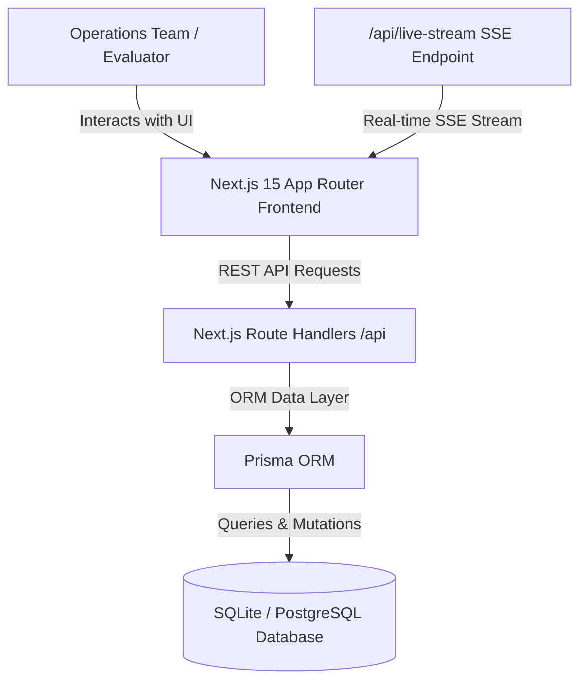

# 🚗 Instant Mechanic — Live Vehicle Service Operations Dashboard

> Production-grade, real-time SaaS operations dashboard designed for managing vehicle service bookings, mechanic dispatches, customer retention, revenue analytics, and live fleet radar tracking.

---

## 🌟 Project Overview

**Instant Mechanic** is an operations control dashboard built for live vehicle service management. It enables operations managers and dispatch teams to monitor incoming service requests, track active mechanics across cities, analyze revenue & service category performance, and update booking statuses in real time—all with zero page reloads.

### Key Capabilities & Highlights
- **560+ Seeded Database Records**: Realistically seeded with 560+ service bookings across 12 months, 24 active mechanics with live GPS markers, 60 customer CRM profiles, and 8 service categories.
- **Server-Sent Events (SSE) Live Feed**: Live stream pushing booking status transitions (`Pending` → `Assigned` → `In Transit` → `In Progress` → `Completed`) and mechanic GPS updates in real time.
- **Interactive GPS Fleet Map**: Dark-mode Leaflet map rendering mechanic markers with live specialization tags, performance ratings, and dispatch status indicators.
- **Visual Analytics Suite**: Recharts integration featuring dual-axis time-series area charts, status distribution donut charts, and service category bar charts.
- **Evaluator Live Simulator Panel**: Built-in control panel allowing evaluators to manually trigger live bookings, advance status pipelines, or re-seed the database on demand.
- **Interactive REST API Documentation**: Swagger-style `/api-docs` page with built-in API tester where evaluators can test endpoints directly inside the web UI.

---

## 🏗️ Architecture & Data Flow



---

## 🛠️ Tech Stack

- **Frontend**: Next.js 15 (App Router), React 18, TypeScript, Tailwind CSS, Lucide Icons, Recharts, Framer Motion, Leaflet.
- **Backend & APIs**: Next.js API Route Handlers (`/api/dashboard`, `/api/bookings`, `/api/mechanics`, `/api/customers`, `/api/analytics`, `/api/live-stream`).
- **Database & Data Engine**: Prisma ORM with SQLite (easily swappable to PostgreSQL / Supabase).
- **Real-time Engine**: Server-Sent Events (SSE) native HTTP stream.
- **DevOps & Testing**: Docker, Docker Compose, GitHub Actions CI workflow.

---

## ⚡ Quick Start & Local Setup

### 1. Prerequisites
- Node.js >= 18.0.0
- npm >= 9.0.0

### 2. Installation & Seed

```bash
# Clone the repository
git clone https://github.com/KratishaTandon1/instant_mechanic_dashboard.git
cd instant_mechanic_dashboard

# Install dependencies
npm install

# Push database schema & seed 560+ realistic records
npx prisma db push
npm run prisma:seed

# Start local development server
npm run dev
```

Open [http://localhost:3000](http://localhost:3000) in your browser.

---

## ⚙️ Environment Variables

Create a `.env` file in the root directory:

```env
DATABASE_URL="file:./dev.db"
NEXT_PUBLIC_APP_URL="http://localhost:3000"
```

---

## 📡 API Endpoints Summary

| Method | Endpoint | Description |
| :--- | :--- | :--- |
| `GET` | `/api/dashboard` | Returns aggregated KPIs, total revenue, status breakdowns, and recent bookings. |
| `GET` | `/api/bookings` | Returns paginated bookings with full-text search, status filter, category filter, and sorting. |
| `POST` | `/api/bookings` | Creates a new vehicle service booking. |
| `GET` | `/api/bookings/:id` | Returns single booking detail with customer & mechanic payload. |
| `PATCH` | `/api/bookings/:id` | Updates booking status (`PENDING` → `ASSIGNED` → `IN_TRANSIT` → `IN_PROGRESS` → `COMPLETED`) or mechanic assignment. |
| `GET` | `/api/mechanics` | Returns active mechanics roster, specialization, ratings, and GPS coordinates. |
| `GET` | `/api/customers` | Returns customer CRM directory with lifetime spend metrics. |
| `GET` | `/api/analytics` | Returns visual chart datasets (time-series, donut distribution, category revenue). |
| `GET` | `/api/live-stream` | Server-Sent Events (SSE) stream for real-time live dashboard sync. |

---

## 🐳 Docker Deployment

To run the application inside Docker:

```bash
# Build & start container
docker-compose up --build -d
```

The application will be accessible at `http://localhost:3000`.

---

## 🤖 AI Usage & Engineering Rationale

- **AI Tools Used**: Antigravity AI Assistant, Gemini 3.6 Flash.
- **Use Cases**:
  - Accelerated initial scaffolding of TypeScript types and Prisma schema definition.
  - Formulated seed dataset generator algorithms (`prisma/seed.js`) to generate realistic vehicle models, addresses, and 560+ date-skewed bookings.
  - Refined SSE real-time event pipeline and dark-mode Tailwind CSS color tokens.
- **Personal Customization & Engineering**:
  - Designed the end-to-end multi-tab architecture, live evaluator simulator drawer, and interactive `/api-docs` testing UI.
  - Implemented client-side CSV exporter, custom Leaflet map markers, and slide-over booking drawer.

---

## 📝 Submission Checklist

- [x] Modern, responsive SaaS UI built with Next.js 15 & Tailwind CSS
- [x] Real-time updates implemented via Server-Sent Events (SSE)
- [x] Database seeded with 560+ Bookings, 24 Mechanics, 60 Customers
- [x] RESTful API endpoints for dashboard, bookings, mechanics, and customers
- [x] Search, filtering, sorting, pagination, and CSV export
- [x] Built-in Evaluator Live Simulator & Interactive API Tester (`/api-docs`)
- [x] Dockerfile, Docker Compose, and GitHub Actions CI workflow included
